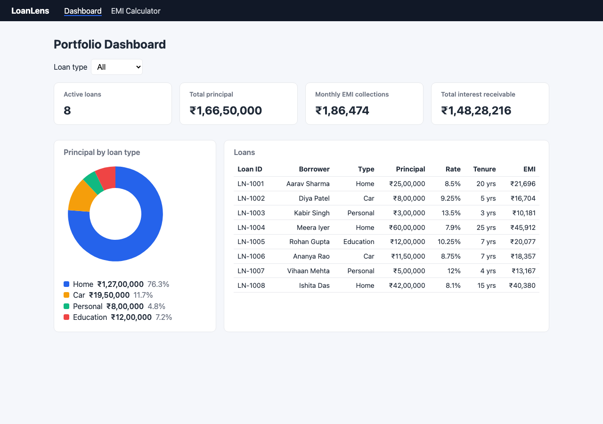
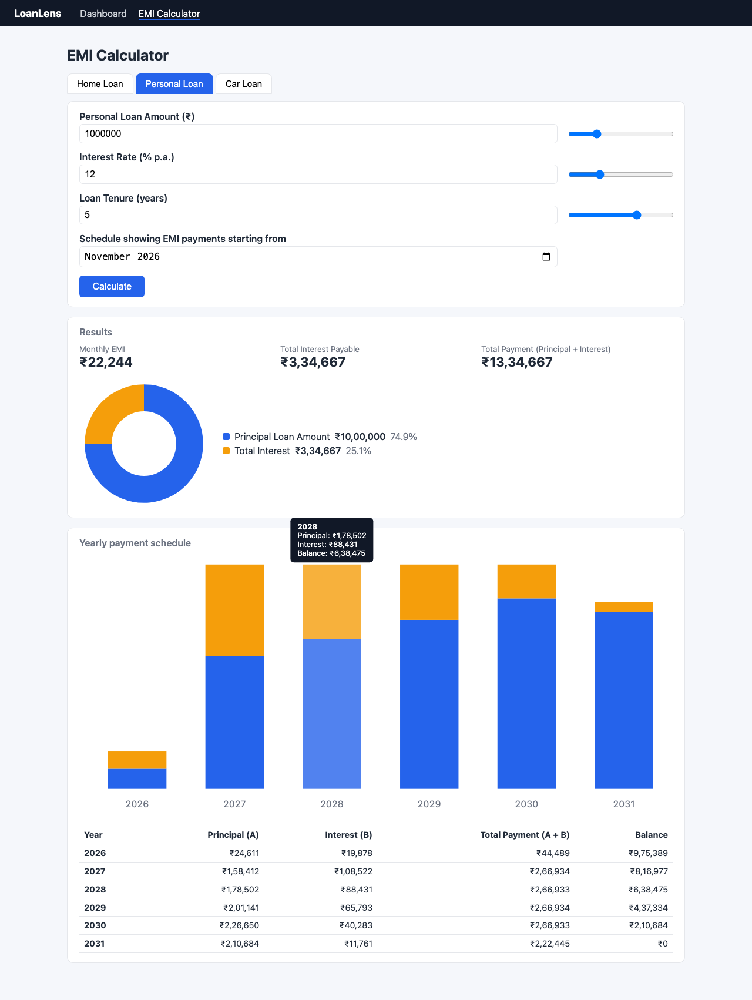

# Streamhub QA Automation Assessment: Section A

A Playwright + Cucumber (BDD) framework that tests three things:

- **LoanLens**, a small EMI-calculator web app built for this assessment (A1, A2)
- the **JSONPlaceholder** `POST /posts` API with boundary and invalid data (A3)
- two **SQL** scenarios on SQLite (A4)

It also includes the **AI self-healing locator** exercise, with a working proof of concept.

**Section A** was chosen because the whole suite runs against code in this repository. The UI tests do not depend on a third-party site, so they stay deterministic.

| | Result |
|---|---|
| Main suite (`npm test`) | **49 / 49 passed**: 24 UI, 23 API, 2 SQL. Six API scenarios are *expected failures* that document real defects; see [A3 findings](#a3-findings-jsonplaceholder-defects) |
| Mutation check | Changing the app's EMI maths slightly makes 15 UI scenarios fail, so the assertions really do check the numbers |
| Broken-locator scenarios (`npm run test:broken`) | 4 fail, 1 **passes against the wrong element** (that is intended; see [self-healing](self-healing/SELF_HEALING.md)) |
| Self-healing POC (`npm run heal`) | 5 / 5 locators detected, repaired and validated in the browser |

---

## Quick start

```bash
npm install
npx playwright install chromium
npm test                       # bddgen + all projects; the app starts automatically
npm run report                 # open the Playwright HTML report
```

| Command | What it runs |
|---|---|
| `npm test` | Everything except `@broken` |
| `npm run test:ui` / `test:api` / `test:sql` | One Playwright project |
| `npm run test:smoke` | Scenarios tagged `@smoke` |
| `npm run test:broken` | The intentionally broken locator scenarios (separate report folder) |
| `npm run heal` / `npm run heal -- --no-ai` | Self-healing POC (Claude, or the offline heuristic) |
| `npm run app` | Start LoanLens on http://localhost:4173 |
| `npm run typecheck` | `tsc` over the framework |

Requires Node 20+. There are no native dependencies: SQLite runs as WebAssembly through `sql.js`.

### Environment configuration (no hard-coded URLs)

[`config/environment.ts`](config/environment.ts) loads `config/env/.env.<TEST_ENV>`. The default is `local`. Real environment variables override the file values.

```bash
TEST_ENV=staging npm test                 # uses config/env/.env.staging and does not start the local app
BASE_URL=http://localhost:5000 npm test   # override a single value
```

| Variable | Purpose |
|---|---|
| `BASE_URL` | Web app under test. Page objects use relative paths |
| `START_APP` | `true`: Playwright's `webServer` starts `app/server.js` |
| `API_BASE_URL` | JSONPlaceholder base URL |
| `API_MAX_RESPONSE_MS` | Response-time budget for the API checks |
| `ANTHROPIC_API_KEY` | Optional; turns on the AI path of the healer |

---

## Architecture

```
app/                      A1: LoanLens web app (zero-dependency Node server + vanilla JS + SVG charts)
config/                   environment loader + per-environment .env files
tests/
  features/{ui,api,sql,self-healing}/*.feature   Gherkin scenarios
  steps/**/*.steps.ts     step definitions (thin; they delegate to page objects and clients)
  steps/fixtures.ts       Playwright fixtures: page objects, API client, SQL db, scenario context
  pages/                  Page Object Model
    components/           PieChart, BarChart (reusable, scoped to a container)
    legacy/               BrittleCalculatorPage: the intentionally broken locators
  api/                    PostsClient + named payloads
  utils/                  independent EMI oracle, currency parsing, sql.js wrapper
sql/{schema,seed,queries,results}   A4: DDL, seed data, queries, output screenshots
self-healing/             AI healing POC + design doc + generated report
reports/                  committed test results (HTML, Cucumber, JUnit, JSON, screenshots, console)
```

**BDD runner.** [playwright-bdd](https://vitalets.github.io/playwright-bdd) compiles `.feature` files into Playwright tests. That gives Gherkin features and step definitions together with the native Playwright runner: fixtures, parallel workers, projects, traces and the HTML report. It also produces a standard Cucumber HTML/JSON report.

**Layers.** A feature file says *what*. A step definition maps the sentence to calls on a page object. The page object knows *how* to find things. Step definitions contain no locators.

**Locator strategy.** Every locator is role-, label- or `data-testid`-based, and scoped to a landmark where that helps: `getByRole('region', { name: 'Results' }).getByTestId('result-emi')`. There are no positional CSS or XPath selectors outside the deliberately broken legacy page. The app was built to support this: each chart mark carries `data-*` values and an `aria-label`, the inputs have labels, and errors are linked through `aria-describedby`. That lets the tests assert on what a screen reader announces (`toHaveAccessibleDescription`).

**Independent oracle.** The tests never import the app's `emi.js`. [`tests/utils/emi.ts`](tests/utils/emi.ts) computes the expected EMI from the closed-form formula, builds the yearly schedule by simulating every month, and also checks that paying the displayed EMI for *n* months brings the balance to zero (a check that does not use the formula).

**Rounding contract.** The EMI is rounded to the nearest rupee. Total payment = round(exact EMI × months). Total interest = total payment − principal. Yearly figures are rounded per year.

---

## A1: The web app

| Dashboard | Calculator (tooltip on 2028) |
|---|---|
|  |  |

- **Dashboard** (`/`): summary cards (loan count, total principal, monthly EMI collections, total interest), a principal-by-type **donut chart**, and a loans **table**. All three are driven by `/api/loans` and a **loan-type filter**.
- **Calculator** (`/calculator`): Home, Personal and Car tabs, each with its own limits. Number inputs are kept in sync with **sliders**. There is a **schedule start month** picker and validation with accessible errors. It shows the EMI, total interest and total payment, a principal/interest **pie chart**, and a yearly **stacked bar chart** with hover tooltips, plus the schedule table.

## A2: UI automation coverage

| Requirement | Scenarios |
|---|---|
| Navigate to the dashboard/report view and check that it loads | `dashboard.feature`: load, nav state, navigation to the calculator |
| Submitted input matches an independently computed value | `emi-calculator.feature`: 6 loans across all tabs, including range edges (₹2 Cr @ 5% / 30y, ₹10K @ 30% / 1y), with the amortisation-to-zero check; slider-driven input (drag, then arrow keys to the exact value); 7 invalid-input cases; dashboard totals per filter |
| Chart is visible and renders non-zero, valid data | `charts.feature`: pie slices > 0 *in value and in rendered area*, equal to principal and computed interest, legend matches, percentages sum to 100; bar count = calendar years of the schedule for the chosen start month; every bar > 0; principal across bars sums to the loan amount; tooltip values equal the independently simulated schedule for 2028. Dashboard donut slices match the portfolio for each filter |

## A3: API tests (JSONPlaceholder)

[`posts-boundary.feature`](tests/features/api/posts-boundary.feature) covers four areas:

- **Long titles**: 255, 256, 10 000 and 1 000 000 characters, plus a payload above the server limit (11 MB).
- **Special characters**: script/HTML injection, SQL injection, emoji and astral-plane Unicode, RTL override and zero-width characters, control characters including `\u0000`, JSON metacharacters, and mixed scripts. Each title must round-trip byte for byte.
- **Missing or invalid fields**: no userId, no title, `{}`, userId as a string, a negative userId, a null title.
- **Malformed JSON**, and whether error responses leak internals.

Every scenario asserts *no server error (< 500)*, JSON content type, a created `id`, and the response-time budget, and attaches the raw response to the report.

### A3 findings: JSONPlaceholder defects

JSONPlaceholder is a mock API, so it does not validate anything. The requirement expects proper 4xx handling. Those expectations are kept as scenarios tagged **`@known-defect @fail`**. Playwright treats them as *expected to fail*, so the suite stays green while the defects stay visible in the report. If the API is ever fixed, those tests will report "unexpectedly passed".

| # | Input | Expected | Actual |
|---|---|---|---|
| 1 | Missing `userId`, empty body, or `userId: "not-a-number"` | 400 | **201 Created**; the invalid data is echoed back |
| 2 | Malformed JSON body | 400 | **500 Internal Server Error** |
| 3 | Error response body | generic message | **Node.js stack trace** (`SyntaxError … at JSON.parse … /app/node_modules/body-parser/…`), which discloses information |
| 4 | Body larger than about 10 MB | 413 Payload Too Large | **500** `PayloadTooLargeError` with a stack trace |

What works: titles up to 1 MB and every special-character category are stored and echoed back exactly, with no truncation, encoding loss or 5xx.

## A4: SQL

Schemas: [`sql/schema/`](sql/schema). Seed data: [`sql/seed/`](sql/seed). Queries: [`sql/queries/`](sql/queries). Output screenshots: [`sql/results/`](sql/results). The [`sql-scenarios.feature`](tests/features/sql/sql-scenarios.feature) scenarios load each schema into an in-memory SQLite database, assert the **exact** result set, check that the negative cases are absent, and save the screenshot.

**Scenario 1: round-trip transfers** ([query](sql/queries/round_trip_transfers.sql), [output](sql/results/round_trip_transfers.png))

- A self-join on the reversed (from, to) pair. The return must come *after* the outbound transfer, at most 24 h later, and differ by at most 10 % of the original amount. Both limits are inclusive.
- The 10 % test is written `|diff| * 10 <= amount` to avoid floating-point error from multiplying by 0.10.
- Timestamp ties are broken by `txn_id`, so a pair is never reported in both directions.
- The seed data covers both boundaries exactly (10 % and 24 h, included), just past them (24 h + 1 s, 10.33 %, excluded), a return that is *higher*, a pair where the earlier transaction id is the return leg, same-direction repeats, A→B→C chains, and one transfer with two qualifying returns.

**Scenario 2: IPL 2024 streaks** ([query](sql/queries/ipl_scoring_streaks.sql), [output](sql/results/ipl_scoring_streaks.png))

- The query uses the gaps-and-islands pattern: `ROW_NUMBER()` over all of a player's 2024 appearances minus `ROW_NUMBER()` over only the 30+ ones gives a constant key for each unbroken streak. It returns the player, streak start date, end date and length.
- *Assumption:* "consecutive matches" means consecutive matches **the player appeared in**. A did-not-bat appearance (`runs IS NULL`) breaks a streak.
- The data is synthetic and generated by [`generate_ipl_seed.js`](sql/seed/generate_ipl_seed.js) as a coherent double round-robin. It covers a player with two separate streaks, exactly 30 runs (counts), 29 runs (breaks), a DNB that breaks a streak, two-match runs (excluded), and a 2023 streak that must not be reported.

## AI self-healing

See **[self-healing/SELF_HEALING.md](self-healing/SELF_HEALING.md)** for the broken locators, the design (detection, prompt approach, validation gates) and the POC results. The latest report is in [self-healing/reports/healing-report.md](self-healing/reports/healing-report.md).

## Test results in this repository

| Artefact | Path |
|---|---|
| Playwright HTML report (screenshots of every UI step) | [`reports/playwright-html/index.html`](reports/playwright-html/index.html) |
| Cucumber HTML / JSON report | [`reports/cucumber/`](reports/cucumber) |
| JUnit XML (for CI) | [`reports/junit/results.xml`](reports/junit/results.xml) |
| Console output of the run | [`reports/console-output.txt`](reports/console-output.txt) |
| Per-test screenshots | [`reports/test-results/`](reports/test-results) |
| SQL output screenshots | [`sql/results/`](sql/results) |
| Broken-locator run | [`reports/broken-run/`](reports/broken-run) |
| Healing report | [`self-healing/reports/`](self-healing/reports) |

In the console output, the six known-defect scenarios show `✘` while counting as passed. That is how Playwright displays an expected failure.

---

## Claude Code reflection

<!-- Written as a draft from the session log. Edit it into your own words before submitting. -->

**How it was used.** Claude Code was a pair programmer for the whole project. It read the assessment PDF, proposed the Section A plan, scaffolded the app, the framework layout, the page objects, the steps and the config, and then iterated on test failures. It probed JSONPlaceholder with `curl` *before* any assertions were written, which is how the real 500 and stack-trace defects were found instead of tests that assumed 4xx responses. It also wrote the SQL queries and verified them against the `sqlite3` CLI before turning them into tests.

**What worked well**
- Exploring the real system first. Probing the API and running the SQL directly gave tests that encode *observed* behaviour plus documented expectations, instead of guesses.
- The mutation check: deliberately breaking the app's EMI maths to prove the tests catch it (15 failures, then green again after the restore).
- Unfamiliar APIs: playwright-bdd's special tags (`@fail`), Playwright's `ariaSnapshot`, `toHaveRole` and `toHaveAccessibleDescription`, and the Anthropic SDK's structured outputs were all checked against the installed package types before use.

**Where it was wrong and had to be corrected**
- `getByLabel('Loan type')` was ambiguous. It substring-matched the "Principal by **loan type**" chart, its SVG and its legend (strict-mode violation). It was replaced with `getByRole('combobox', { name: 'Loan type' })`.
- The first version of `visibleLoanTypes()` was convoluted and read a column by hard-coded index. It was rewritten to find the column through its header text.
- The healer's first validation pass approved `getByRole('spinbutton', { name: 'Home Loan Amount' })`, because the re-render gate switched tabs and then switched *back*. The gate now stays on a different tab, which forces the stable name `'Loan Amount'`.
- The result-value fingerprint (role `definition` only) was too weak, because any `₹` figure passed. It now also checks the labelling `<dt>` term.
- The heuristic healer missed the Calculate button: `<button type="submit">` was looked up as `button:submit` with no fallback to `button`, and "calculates" never matched "calculate". Both were fixed (lookup fallback, plus stemming).
- `tsx` wraps named inner functions in a `__name()` helper that does not exist in the browser, so `locator.evaluate` crashed. The cleanup code was moved to the Node side.
- The "broken" amount locator **passed**. Playwright fills range inputs, so the positional XPath quietly drove the slider. That turned out to be the most useful finding: self-healing has to detect *wrong* elements, not only missing ones.

**What did not work or was left out**
- The AI path of the healer was implemented and type-checked, and it falls back cleanly without credentials. The committed report, however, comes from the offline heuristic run, because no API key was available in this environment.
- Fixes are suggested, never auto-applied. That is deliberate (see the design doc), but it means there is no codemod yet.
